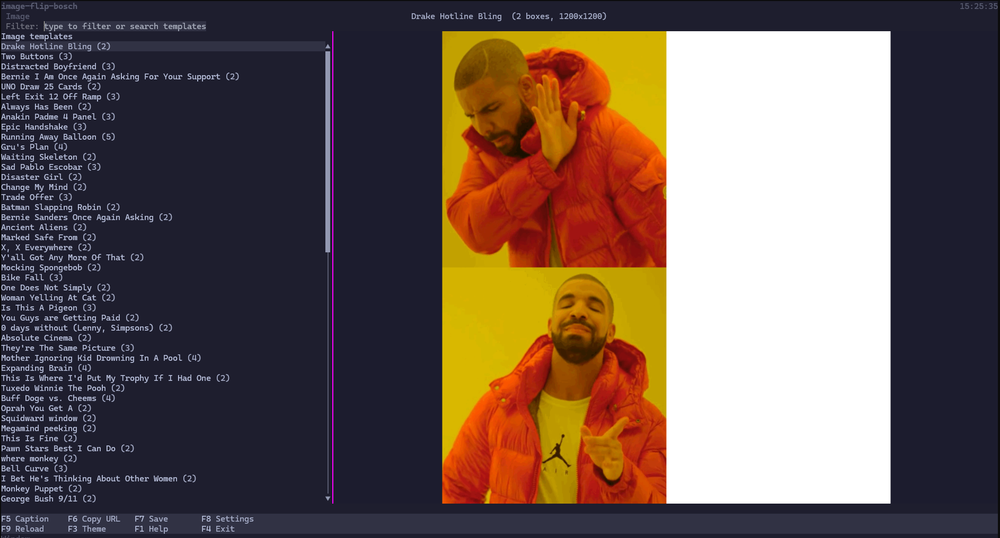
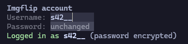
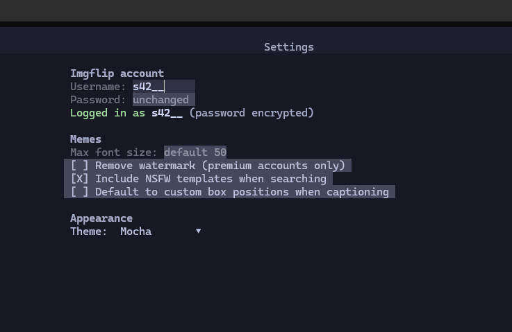
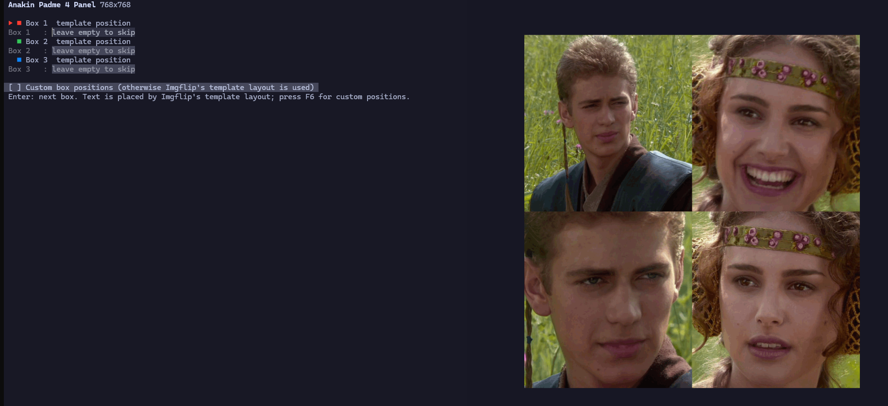
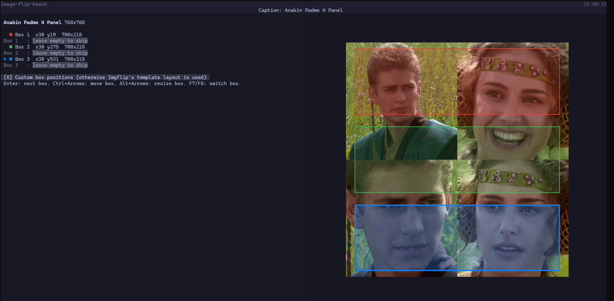
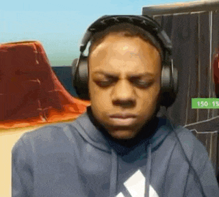

# Img Flip CLI 

Dieses Tool ermöglicht dir memes direkt über dein Terminal zu erstellen!

Alle regulären Features von ImgFlip sind supported.

# Free Features

## Template Browser
Der Template Browser dient damit man sich Meme Templates anschauen kann und dann daraufhin auch bearbeiten kann
( Bearbeitung der Meme Templates geht nur mit Validem ImgFlip Account, siehe Sektion Login)

Keybinds im Template Browser:
- F5 Meme Template bearbeiten
- F6 Erstelltest Meme Kopieren
- F7 Template/Erstelltes Meme Speichern
- F8 Einstellungen
- F9 Neuladen
- F3 Theme togglen
- F1 Hilfe
- F4 Beenden

## Login
Um Templates zu benutzen, müssen sie sich einmal mit ihrem ImgFlip Username und Passwort anmelden.
Das Password wird Lokal verschlüsselt und nur bei einem API Call entschlüsselt für die API request.

Den Login findet ihr unter den Einstellung (Siehe Sektion Einstellungen). Ausloggen könnt ihr dann im Einstellungs Fenster mit F6

## Einstellungen
In den Einstellungen können sie sich unter anderem in ihren Account einloggen oder das Theme der CLI ändern.
In die Einstellungen kommen sie mit dem F8 Knopf während sie auf dem Template Browser seid.

In den Einstellungen können sie diese Sachen machen:
- Watermark von den Memes Entfernen (Premium Only)
- NSFW Templates inkludieren
- Standardmäßig das Custom Box Layout Feature benutzen beim Meme erstellen (siehe meme erstellen)
- Themes einstellen
- Login und Logout

Die Keybinds in den Settings sind:
- F6 Logout
- F2 Einstellungen Speichern
- F3 Theme durchwechseln
- ESC Rückkehr zum Template Browser

## Erstellung eines Memes
Wenn du per F5 zum Meme bearbeiten gekommen bist, kannst du einmal die vorgegebenen bereiche für die Meme Template benutzen oder deine eigenen Positionen Auswählen.
Beim ersteren gibst du einfach nur den Text ein und togglest durch mit TAB.

Um den Freien modus zu aktivieren müssen sie erstmal in diesen modus entweder direkt im erstellungs Fenster oder in den Einestellungen aktivieren, im Erstellungs Fenster geht dies 
mit dem Keybind F6.

Im modus wo du die Text bereiche frei auswählen kannst, kontrollierst du die größe der einzelnen boxen mit ALT + Pfeiltasten, bewegen kannst du diese Boxen dann mit STRG + Pfeiltasten.
Dies kann sich sehr langsam anfühlen aber liegt am Terminal (Clueless)

Keybinds:
- F5 Meme erstellen
- F6 Manuellen Modus Togglen
- F7 Letzter Text input Tab
- F8 Nächster Text input Tab
- ESC Abbrechen
- ALT + Pfeiltasten Größe der Boxen ändern
- STRG + PFEILTASTEN Position der Boxen ändern

## Premium Features
- Mehr als 100 Templates laden (inkl. Suche)
- Watermark von Memes entfernen
- GIF Template Browser

### Persönlicher Flex

Wir haben einen Nativen Image Viewer im Terminal gecodet womit man in geiler Qualität Bilder im Terminal einsehen kann.

Wir haben einen GIF renderer fürs Terminal.

### Dev

Debug: -DShowDebugScreen
Gif Test: giftest
Login: login
Logout: logout
